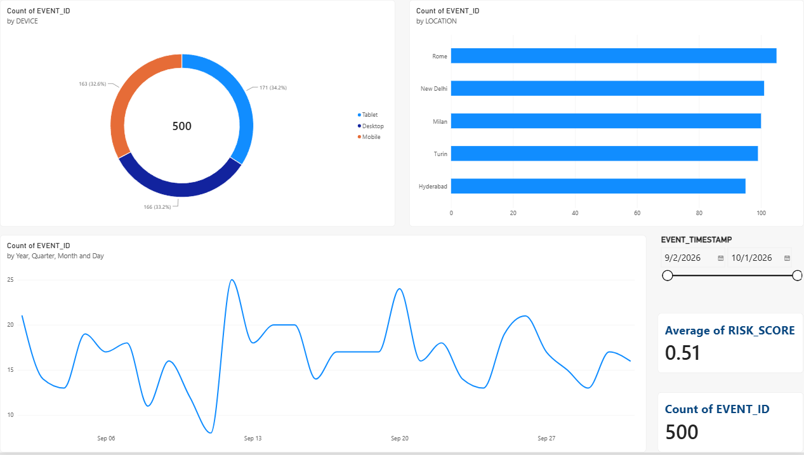
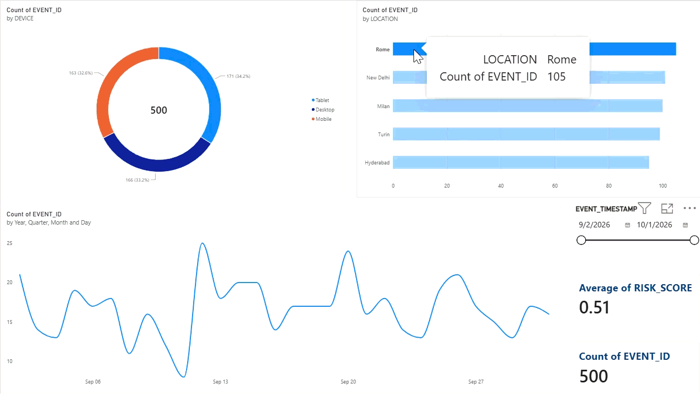

# 🚀 E-Commerce Real-Time Fraud Engine & Executive Analytics Pipeline

An end-to-end fraud detection and telemetry analytics solution built to simulate, process, store, and visualize high-risk e-commerce transaction events. This project demonstrates modern data stack (MDS) capabilities, leveraging Python for synthetic data generation, Snowflake for cloud data warehousing, and Power BI for executive-level business intelligence.

---

## 🛠️ Tech Stack & Architecture

* **Data Generation & Orchestration:** Python (Pandas, NumPy, Faker), Google Colab
* **Cloud Data Warehouse:** Snowflake (`PORTFOLIO_DB`)
* **Data Visualization & BI:** Power BI Desktop (`Fraud_Telemetry_Executive_Dashboard.pbix`)
* **Version Control:** Git & GitHub

---

## 📊 Key Features & Components

1. **Synthetic Telemetry Simulation:** Generates realistic e-commerce event streams including transaction amounts, device categories, timestamps, user IDs, and geographic locations.
2. **Cloud Data Warehouse (`Snowflake`):** Tables structured and queried efficiently for rapid aggregation and analytics retrieval.
3. **Interactive Power BI Executive Dashboard:**
   * **Executive KPI Cards:** Real-time tracking of **Total Event Volume (500)** and **Average Risk Score (0.51)**.
   * **Trend Line Chart:** Time-series analysis tracking transaction volume spikes and patterns across temporal intervals.
   * **Geographic Bar Chart:** Regional event distribution mapping out global hubs (Rome, New Delhi, Milan, Turin, Hyderabad).
   * **Device Donut Chart:** Categorical split analyzing user device types (Desktop, Mobile, Tablet).
   * **Dynamic Date Slicer:** Interactive timeline filtering enabling stakeholders to slice data by custom date ranges.

---

## 🖥️ Dashboard Preview & Demo

### **Executive Overview**


### **Interactive Cross-Filtering & Slicers**


---

## 📈 Impact & Resume Highlights

* Engineered a robust end-to-end analytics workflow from raw data simulation to production-grade visualization, reducing manual reporting bottlenecks.
* Leveraged advanced Snowflake SQL and Power BI modeling to deliver sub-second query performance and executive-level risk visibility.
* Established a scalable reporting framework capable of tracking operational throughput, geographic distribution, and device-level vulnerability metrics.

---

## 🚀 Getting Started

1. **Clone the Repository:**
   ```bash
   git clone [https://github.com/your-username/ecommerce-fraud-engine.git](https://github.com/your-username/ecommerce-fraud-engine.git)
